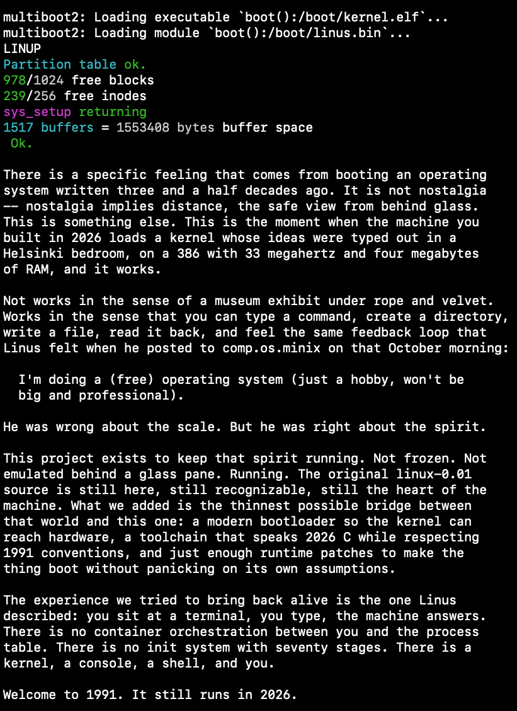
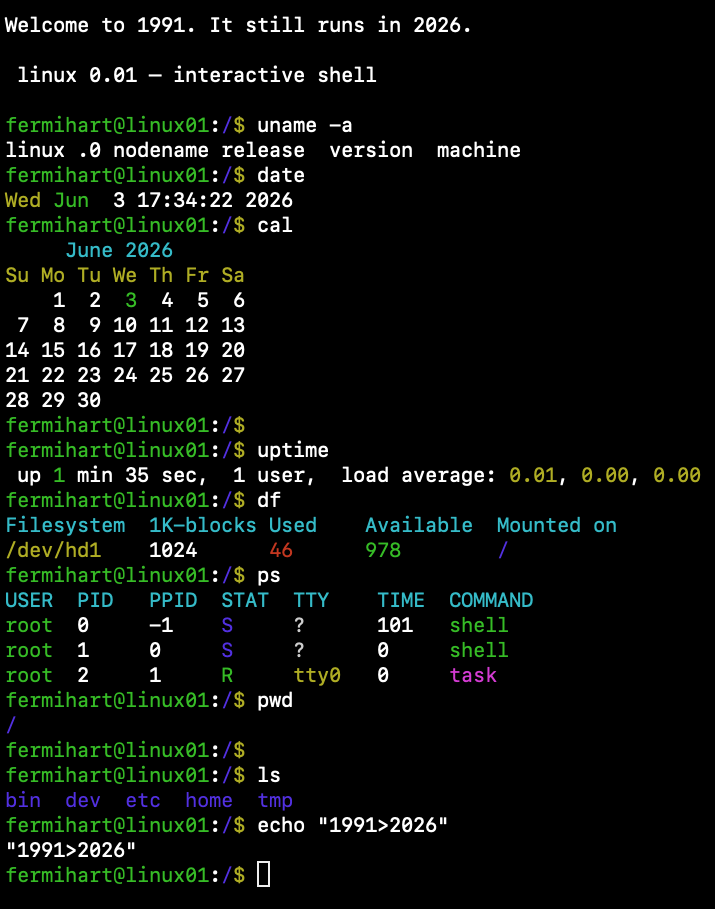
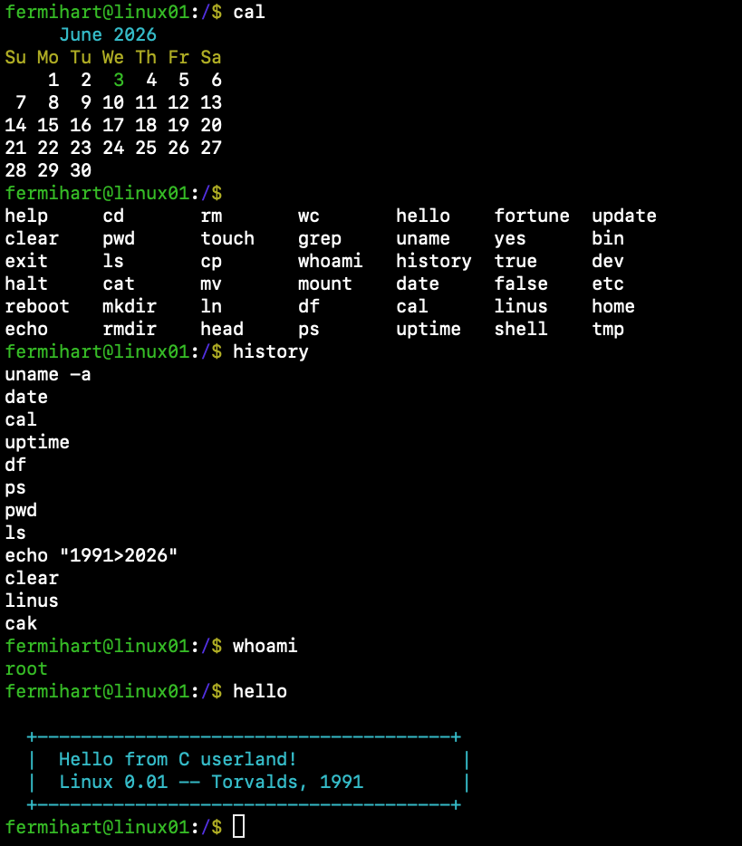
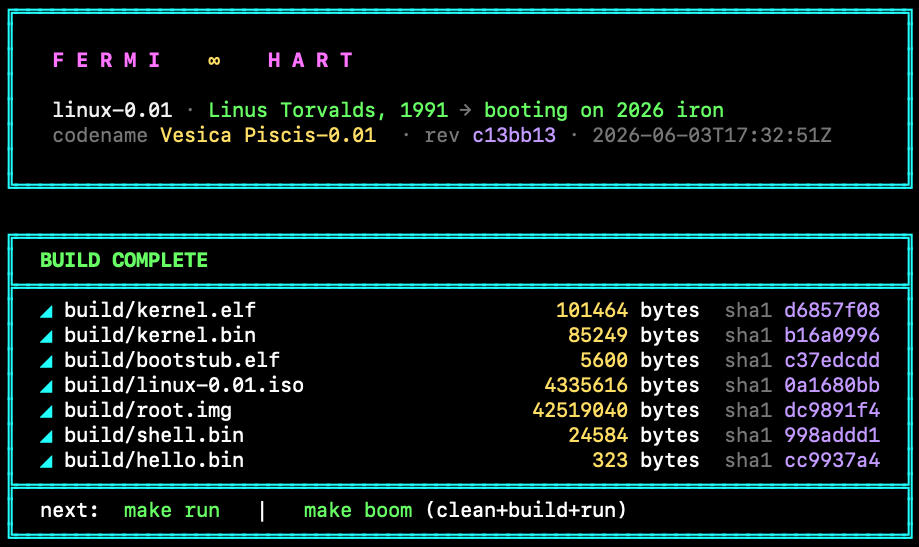
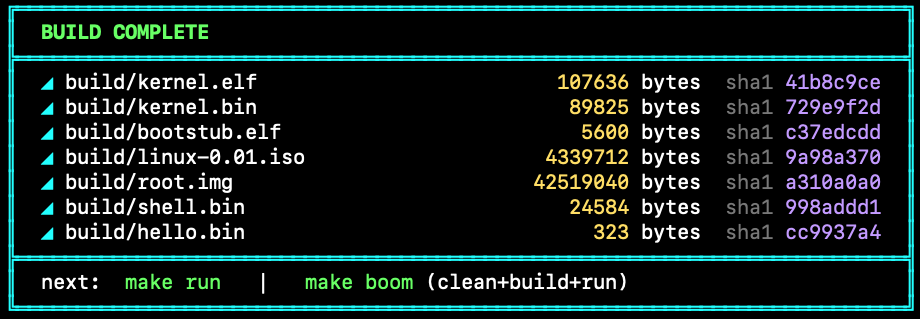
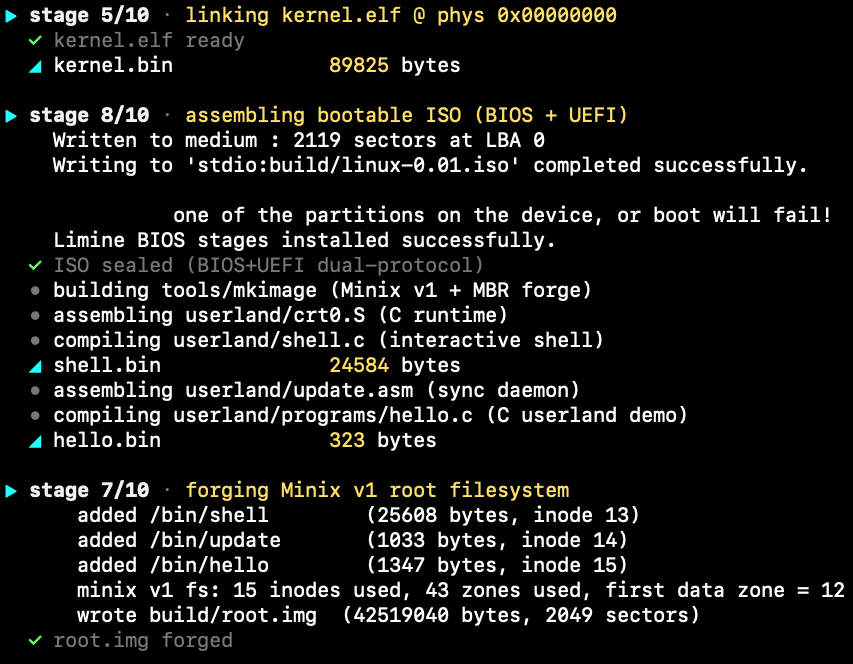
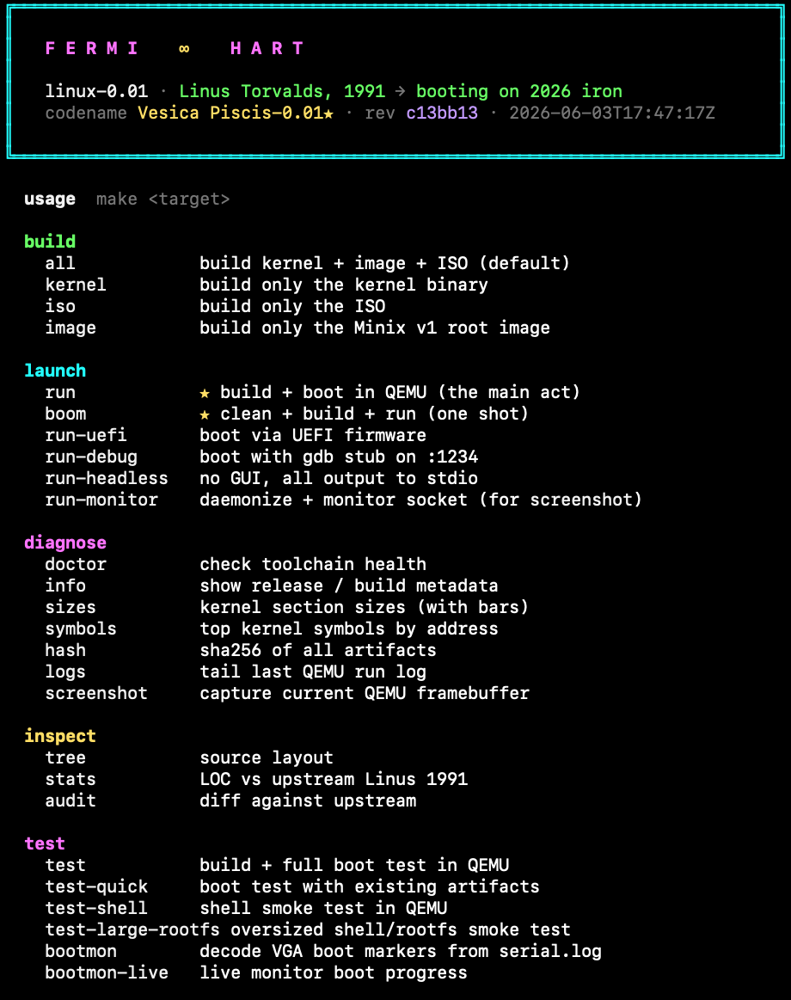

<div align="center">

# linux-0.01-still-runs

**Linus Torvalds' 1991 kernel, booting on 2026 silicon.**

Hardware-virtualized and firmware-free. Not behind glass. Running.



[](https://github.com/fermihart/linux-0.01-still-runs/actions/workflows/build.yml)
[](LICENSE)
[](#)
[](#)

</div>

---

## A letter from 1991

There is a specific feeling that comes from booting an operating system written three and a half decades ago. It is not nostalgia — nostalgia implies distance, the safe view from behind glass. This is something else. This is the moment when the machine you built in 2026 loads a kernel whose ideas were typed out in a Helsinki bedroom, on a 386 with 33 megahertz and four megabytes of RAM, and *it works*.

Not works in the sense of a museum exhibit under rope and velvet. Works in the sense that you can type a command, create a directory, write a file, read it back, and feel the same feedback loop that Linus described in his 25 August 1991 comp.os.minix post:

> I'm doing a (free) operating system (just a hobby, won't be big and professional).

He was wrong about the scale. But he was right about the spirit.

This project exists to keep that spirit running. **Not frozen behind a glass pane. Running.** The historical Linux 0.01 core — every `sched.c`, every `buffer.c`, every hand-tuned assembly routine — is still here, still recognizable, still the heart of the machine. What we added is a deliberately bounded bridge between that world and this one: a firmware-free KVM runner with emulated legacy devices, a toolchain that speaks 2026 C while respecting 1991 conventions, and documented runtime patches that make the thing boot without hiding its changed assumptions. The current evidence proves one sufficient bridge configuration, not a minimum one.

**Welcome to 1991. It still runs in 2026.**

---

## Quick start

The runtime requires Linux with `/dev/kvm`. Build and boot directly:

```bash
sudo apt install build-essential nasm python3

git clone https://github.com/fermihart/linux-0.01-still-runs
cd linux-0.01-still-runs
make toolchain   # verify/install missing build tools and KVM access
make boom        # clean + build + boot the alive profile
make run EXPERIENCE=1991  # explicit historical profile
make run EXPERIENCE=alive # explicit alive profile (the default)
```

The 1991 profile selects `build/root-1991.img`, carries its identity through the
validated BBP command line, uses `/` as root's home, and boots with a concise
period-style MOTD. Its CMOS boot epoch is fixed at the Linux 0.01 release date,
1991-09-17 00:00:00 UTC, then advances through the kernel's normal PIT and
`jiffies` path. The default alive profile uses `build/root.img`,
`/home/fermihart`, one coherent host UTC snapshot, and the Vesica Piscis
narrative.

Inside the booted system:

```sh
root@linux01:/# date              # Y2K-aware date from the RTC
root@linux01:/# cal               # current month, today highlighted
root@linux01:/# fortune           # Unix quotations
root@linux01:/# linus             # the 25 Aug 1991 comp.os.minix post
root@linux01:/# uptime            # seconds since the shell started
root@linux01:/# ps aux            # bounded snapshot of scheduler tasks
root@linux01:/# cat /etc/motd     # the letter above, on the VGA console
```

---

## Screenshots

<div align="center">

| | |
|:---:|:---:|
| <br/>**Interactive shell** — a 1991 Unix command suite | <br/>**C userland** — `/bin/hello` built with the cross toolchain |
| <br/>**Cinematic build** — `make` with a Unicode splash | <br/>**Checksummed artifacts** — SHA-256-stamped on every build |
| <br/>**Build pipeline** — kernel → BBP-aware bEMU → Minix v1 rootfs forge | <br/>**`make help`** — every target, self-documenting |

</div>

---

## Two-layer design

| Layer | Purpose | Status |
|-------|---------|--------|
| **Historical core** — `init/`, `kernel/`, `mm/`, `fs/`, `lib/`, `include/` | Linux 0.01 source released in September 1991, with documented compatibility and artifact patches | Recognizable line-for-line against the [kernel.org tarball](https://www.kernel.org/pub/linux/kernel/Historic/linux-0.01.tar.gz) |
| **Modern port** — `bemu/`, `bbp/`, `boot/`, `tools/`, `userland/`, `tests/`, `Makefile` | Direct KVM entry, BBP handoff, root-image generation, interactive shell, VGA 80×50 mode-set, bEMU smoke tests | New, minimal, written to feel period-correct where it touches the kernel |

This is therefore best described as **Linux 0.01 that runs today**, not a byte-for-byte preservation tree. For archaeology, compare against the official tarball. For experimentation, boot this repo.

---

## What you get

- **VGA 80×50 text mode** using an 8×8 PC-compatible character set derived from SeaBIOS VGA font data
- **Colored interactive shell** (`userland/shell.c`) with emacs line editing, tab completion, history, `$PATH`, kernel pipes, and `<`, `>`, `>>` redirection
- **Small Unix-style command suite**: `date`, `cal`, `uptime`, `fortune`, `yes`, `true`, `false`, plus a documentary `linus` command that prints the original comp.os.minix announcement
- **Minix v1 filesystem** built by hand at image time (`tools/mkimage.c`), with `/etc/motd`, `/etc/passwd`, `/bin/{shell,hello,update,yes,pathcheck,cat}`, `/dev/tty0`
- **Firmware-free bEMU boot** — KVM enters the validated `kernel.bin` payload at physical zero with no BIOS, UEFI, ISO, or bootloader
- **Real BBP handoff** — bEMU publishes CRC64-checksummed HHDM, memory-map, kernel-address, command-line, and hypervisor tags at physical `0xC0000`; CRC64 detects corruption but does not authenticate the producer
- **Profile-aware CMOS time** (fixed 1991 release epoch in historical mode;
  coherent host UTC snapshot and Y2K correction in alive mode)
- **Automated validation**: build → direct KVM boot → run the full shell smoke suite

---

## Architecture

| Stage | Component | What it does |
|-------|-----------|--------------|
| 1 | `bemu/{memory,loader,bemu_linux01}.c` | Validates and loads the `kernel.bin` payload, creates BBP, and provides legacy devices through KVM |
| 2 | `boot/head.s` | Reprograms the PIC, initializes IDT/GDT and paging, zeros BSS, calls `main()` |
| 3 | `bbp/linux01_bbp.c` | Validates bEMU identity, memory-map, kernel-address, command-line, and hypervisor tags |
| 4 | `init/main.c` | VGA 80×50 mode set → time → tty → traps → sched → buffer → fork-init |
| 5 | Linus' 1991 kernel | scheduler, fork, exec, Minix VFS, block/char devices, signals, pipes |
| 6 | Userland | `crt0.S` + interactive shell + `/bin/hello` demo |

Deep dive: [ARCHITECTURE.md](ARCHITECTURE.md).

---

## Build / run / test

```bash
make help            # show the main public targets with one-line descriptions
make all             # full build (kernel + root.img + bEMU), -Werror clean
make run             # build + direct KVM boot in the terminal
make run-headless    # alias for make run; bEMU is terminal-native
make boom            # clean + build + run — cinematic one-shot demo
make test            # boot + full shell, editor, trace, and large-rootfs tests
make fault-test      # run all Waves 096-103 deterministic fault scenarios
make test-fault-catalog # validate the Waves 096-103 evidence catalog
make test-bemu-loading # guest RAM and kernel loading limits before KVM
make test-ide-faults # host-only deterministic IDE read/write failures
make test-power-cut  # semantic IDE write cuts on disposable root copies
make test-irq-faults # host-only lost/duplicated IRQ edges
make test-irq-faults-kvm # real KVM irqchip fault integration
make test-keyboard-faults # invalid scancodes and truncated host input
make test-bbp-corruption # production BBP parser/semantic corruption matrix
make test-artifact-truncation # canonical kernel/root truncation before KVM
make test-fs-corruption # offline Minix superblock/inode/bitmap faults
make doctor          # toolchain health check
make sizes           # kernel section sizes
make hash            # SHA-256 of all artifacts
```

The expected and observed responses, execution layers, requirements, evidence,
and non-claims for every deterministic fault are in
[docs/FAULT-CATALOG.md](docs/FAULT-CATALOG.md).
The five academic questions and their operational evidence boundaries are in
[docs/RESEARCH-QUESTIONS.md](docs/RESEARCH-QUESTIONS.md).
The experimental controls, repetition counts, oracle classes, retention policy,
and analysis rules are in [docs/METHODOLOGY.md](docs/METHODOLOGY.md).
The complete technical paper, including results and threats to validity for all
five questions, is [docs/PAPER.md](docs/PAPER.md).
The clean-clone, one-command artifact procedure, expected outputs, validation
steps, timing guidance and troubleshooting are in
[docs/REPRODUCTION.md](docs/REPRODUCTION.md).
The versioned evaluator checklist, bounded claim-to-command-to-evidence map,
environment capture protocol, and redistribution notices are in
[evaluation/v1/](evaluation/v1/).
The versioned historical-core patch, per-path hashes, stable adaptation IDs,
ledger joins, and explicit evidence gaps are in
[datasets/patches/](datasets/patches/).
The inherited console and machine golden traces, exact event schema, comparison
policy, checksums, and missing capture identities are in
[datasets/golden-traces/v1/](datasets/golden-traces/v1/).
The versioned 18-cell reduced compiler reference run, retained binaries and
assembly, environment identities, and tri-state classifications are in
[datasets/compiler-cases/v1/](datasets/compiler-cases/v1/).

Quick targeted shell test (≈ 30s per run):

```bash
python3 tests/qquick.py "date" --expect "2026"
python3 tests/qquick.py "ls"   --expect "bin"  --setup "cd etc"
```

Toolchain: `x86_64-elf-gcc` or native GCC with `-Wall -Werror -O2 -std=gnu89 -m32 -march=i386 -ffreestanding`; plus NASM, a host C compiler, Python 3, Linux KVM headers, and writable `/dev/kvm` for execution.

---

## Guest commands

| Command | What it does |
|---------|--------------|
| `help` | List the bounded command surface |
| `clear` | Clear the screen |
| `echo <text>` | Print text; generic `<`, `>`, and `>>` redirection is handled by the shell |
| `cat [file]` | Read regular files or standard input |
| `man [topic]` | Read ASCII manual pages stored in `/usr/man/man1` on the Minix v1 image |
| `ls` / `ls -la` | Coloured directory listing (blue dirs, green executables, yellow devices) |
| `cd <dir>` / `pwd` | Change directory + track cwd |
| `mkdir` / `rmdir` / `touch` / `rm` | Real Minix v1 operations through Linux 0.01 syscalls; `rm` is not recursive |
| `cp` / `mv` / `ln` | Copy, move, hard-link |
| `head` / `wc` / `grep` | Classic text inspection |
| `whoami` / `mount` / `df` / `ps aux` | Identity, configured root mount, live filesystem counters, and up to 16 task slots |
| `history` | Up to 100 entries; saved to `/.sh_history` on an orderly halt/reboot |
| `uname` / `uname -a` | Linux 0.01 `uname` syscall |
| **`date`** | Current date/time from CMOS RTC |
| **`cal`** | Month calendar, today highlighted |
| **`uptime`** | Seconds since the shell started; no invented load average |
| **`fortune`** | Alive-only Unix quotations; absent from the 1991 profile |
| **`yes [text]`** | External process that repeats until its write fails |
| **`true`** / **`false`** | No-output compatibility commands; this shell has no `$?` expansion |
| **`linus`** | Alive-only text of the August 1991 post with retrospective epilogue |
| `hello` | External userland demonstration reached through `$PATH` |
| `/bin/hello`, `/bin/yes`, `/bin/cat` | External programs executed through `$PATH` or an explicit path |
| `halt` / `reboot` / `exit` | Sync and terminate the current bEMU process; `reboot` does not reset/restart the VM in-process |

Tab completion: press `Tab` once to complete, twice to list matches in columns. Line editing: emacs bindings (`Ctrl-A/E/K/U/W/Y`, arrow keys for cursor + history).

Pipelines support up to eight simple stages. Each stage is a real child process;
the shell connects them with Linux 0.01 `pipe(2)` and `dup2(2)`. Quoting,
globbing, job control, and command substitution are deliberately outside the
current historical shell surface.

Both profiles deliberately omit package managers, network tools, language
runtimes, guest compilers/build suites, desktops and browsers. The experience
tests also prove that variable, glob, quoting, substitution, command-list and
background-job syntax remains literal rather than acquiring modern semantics.
Modern compilers, Python and KVM belong to the host-side observation bridge,
not to the guest.

The shell accepts at most 255 input bytes, 30 arguments per stage, 64 tokens
per line, eight pipeline stages, and 64 completion matches. Minix v1 limits
each path component to 14 bytes. These implementation limits are reported
explicitly rather than being presented as syntax errors.

---

## Notable fixes & curiosities

- **`-O2` sensitivity in `fs/buffer.c`, `fs/bitmap.c` and `kernel/vsprintf.c`.** We compile `fs/buffer.o`, `fs/bitmap.o` and `kernel/vsprintf.o` at `-O1` as a conservative shield. The versioned 18-cell hosted reference run in `datasets/compiler-cases/v1/` observes only `bitmap_inline_asm/x86_64/O2` failing: its inline asm declares modified memory as input-only, supporting a source-contract violation in that reduction rather than a GCC bug. `buffer_freelist` and `vsprintf_percent_s` pass every retained cell, so their historical symptoms remain unproven hypotheses. The run is not the freestanding kernel ABI and does not prove that `-O1` is necessary or minimal.
- **CMOS Y2K rollover.** `kernel_mktime` reads `tm_year` as years-since-1900; CMOS gives 2-digit year, so `26` meant 1926 → epoch went negative → `date` showed Jan 1 1970. Treat `< 70` as `20yy`.
- **Serial throughput.** UART was at 2400 baud with polled busy-wait; `printk` also routed every byte twice (`serial_puts` *and* `tty_write` → `con_write` → `serial_console_write`). At 26 commands the write_q saturated and the shell blocked. Bumped to 115200, dropped the duplicate path.
- **CP437 on VGA.** Original `con_write` filtered to bytes 32–126. Since we ship the full PC-compatible 8×8 font in plane 2, loosened the filter to let extended slots through — `∞` at `0xEC`, box-drawing chars, math symbols.

---

## Known limitations

| | |
|---|---|
| The supported build/test host is Linux KVM | bEMU requires Linux headers and writable `/dev/kvm`; no fallback backend is claimed |
| Orderly cross-process persistence is scoped to bEMU's virtual medium | `sync` + terminal halt is proven across fresh bEMU/KVM/RAM instances; in-process reset and physical-media durability are not claimed |
| Shell grammar is intentionally small | no quoting, globbing, job control, command substitution, or modern shell extensions |
| `/bin/yes | head` may block | Linux 0.01 pipe close/SIGPIPE behavior is no longer hidden by a bounded built-in `yes`; finite external pipelines are tested instead |
| System views are bounded | `mount` reports the configured root, `ps` exposes at most 16 task slots, and `uptime` starts with the shell because Linux 0.01 has no modern procfs/load-average interface |

---

## License

The historical kernel remains © 1991 Linus Torvalds under the original Linux
0.01 distribution terms. Modern files are under the Unlicense unless they
carry another identifier; identified bEMU/BBP files use BSD-3-Clause. See [LICENSE](LICENSE)
for the complete notices and the pinned provenance of the public-domain VGA
font data.

---

<div align="center">

**F E R M I ∞ H A R T**

</div>
